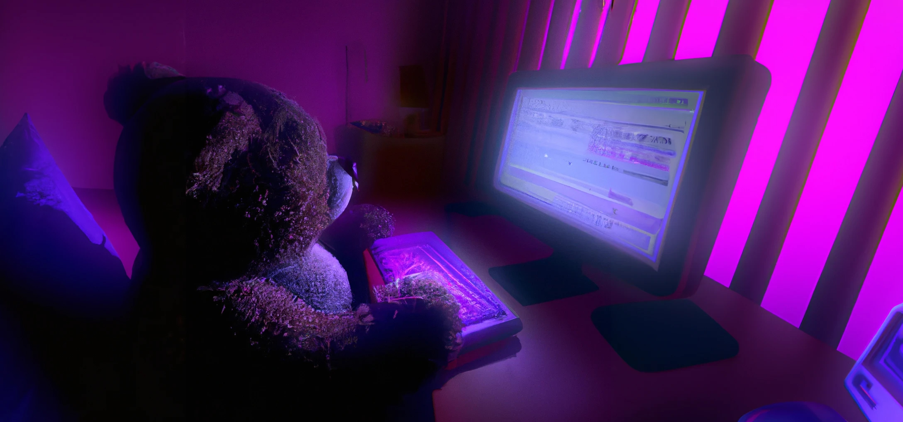

## 👋 Hi, I am Fatih Kabul

### About Me
Hey there! I'm Fatih, a passionate frontend developer who loves coding and camping. I enjoy blending creativity with technology to build immersive web experiences.
I also offer freelance services, helping businesses and individuals bring their ideas to life with modern web technologies. If you have a project in mind, feel free to reach out!

### 🌐 Website
Check out my work at: [fatihkabul.vercel.app](https://fatihkabul.vercel.app)

### 📲 Connect with Me
- **LinkedIn:** [Fatih Kabul](https://linkedin.com/in/fatihkabul)
- **GitHub:** [FatihSAMA](https://github.com/FatihSAMA)
- **Behance:** [Fatih Kabul](https://www.behance.net/fatihkabul)
- **Instagram:** [@fatih_kbl](https://www.instagram.com/fatih_kbl/)

### 💻 Tech Stack

  
  
  
  
  
  
  
  

Let's build something awesome together! 🚀

